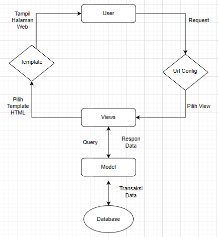

# README

## Link aplikasi Heroku
https://project2pbp.herokuapp.com/katalog/



1. Kaitan antara ```urls.py```, ```views.py```, ```models.py```, dan berkas ```html``` yaitu awalnya user meminta request kepada ```urls``` yang nantinya ```urls``` akan memilih view ke ```views``` dan akan memiliki template HTML yang terdapat pada file django tersebut. Dari template ```html``` tersebut akan memilih tampilan halaman web yang nantinya akan dikembalikan kepada user.

2. Kenapa kita membutuhkan _virtual environment_ dalam melakukan project django yaitu karena alat yang membantu menjaga dependensi yang diperlukan oleh berbagai proyek terpisah dengan membuat _virtual environment_ python yang terisolasi untuk mereka. Ini adalah salah satu alat terpenting yang digunakan sebagian besar pengembang Python.  _virtual environment_ juga harus digunakan setiap kali mengerjakan proyek berbasis python. Secara umum bagus untuk memiliki satu lingkungan virtual baru untuk mengerjakan setiap proyek berbasis python. Jadi, pada setuap ketergantungan proyek tersebut disolasi dari sistem dan satu sama lain.

3.

```
from django.urls import path
from katalog.views import show_katalog

app_name = 'katalog'

urlpatterns = [
    path('', show_katalog, name='show_katalog'),
]   
```
Pada ```urls``` yang berada pada folder katalog tersebut yaitu digunakan untuk melakukan _routing_ terhadap fungsi ```views``` yang telah dibuat yang nantinya akan membuat halaman HTML dapat ditampilkan lewat browser.

```
from django.shortcuts import render
from katalog.models import CatalogItem

def show_katalog(request):
    data_barang_katalog = CatalogItem.objects.all()
    context = {
        'list_barang' : data_barang_katalog,
        'nama' : 'Muhammad Rafi Adiwibowo',
        'id' : '2106653855',
    }
    return render(request, "katalog.html", context)
```
Pada fungsi ```views``` diatas fungsi tersebut akan menggunakan class tersebut untuk melakukan pengambilan data dari _database_

```
from django.db import models

class CatalogItem(models.Model):
    item_name = models.CharField(max_length=255)
    item_price = models.BigIntegerField()
    item_stock = models.IntegerField()
    description = models.TextField()
    rating = models.IntegerField()
    item_url = models.URLField()
 ```
 Pada ```models``` tersebut terdapat CatalogItem yang isinya merupakan nama-nama, ataupun harga, dan lain sebagainya yang nantinya akan dipakai pada saat ```html``` untuk dipanggil beserta isinya.
 
```
    
    <tr>
        <th>{{barang.item_name}}</th>
        <th>{{barang.item_price}}</th>
        <th>{{barang.item_stock}}</th>
        <th>{{barang.description}}</th>
        <th>{{barang.rating}}</th>
        <th>{{barang.item_url}}</th>
      </tr>
```
Pada ```html``` ini melakukan iterasi terhadap variabel ```list_barang``` yang telah dibuat pada ```views``` didalam CatalogItem dan juga melakukan pemanggilan nama ataupun variabel spesifik dari objek yang dibuat untuk memanggil data dari objek tersebut.

