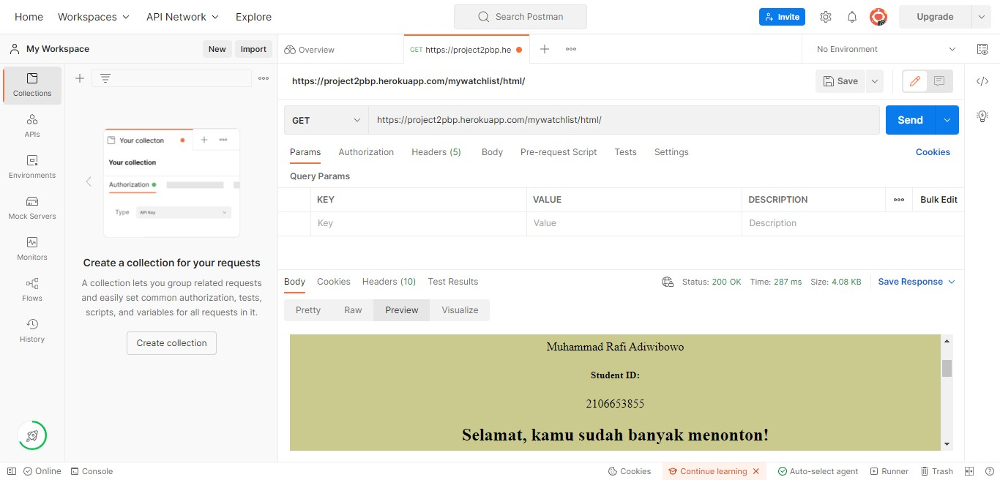
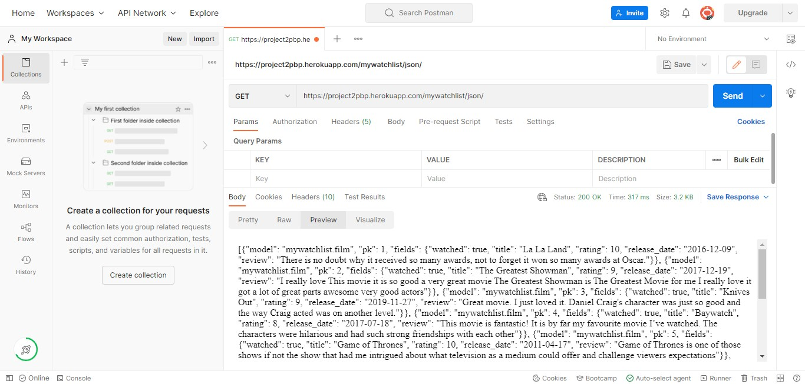
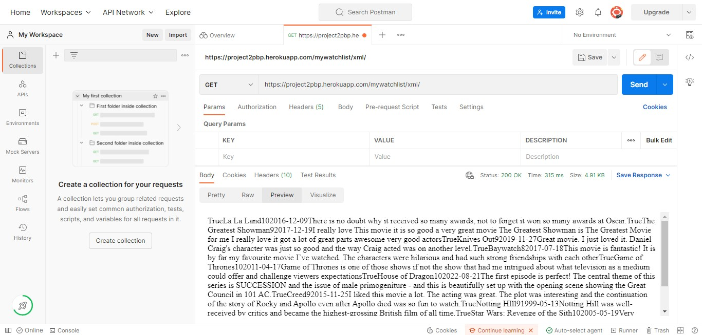

# Tugas 3 PBP
### Muhammad Rafi Adiwibowo
### 210663855
### PBP - A

## Link aplikasi Heroku
- https://project2pbp.herokuapp.com/mywatchlist/html/
- https://project2pbp.herokuapp.com/mywatchlist/json/
- https://project2pbp.herokuapp.com/mywatchlist/xml/

1. Perbedaan ```JSON```, ```XML```, dan ```HTML``` adalah yang pertama ```JSON``` didesain menjadi self-describing, sehingga JSON sangat mudah untuk dimengerti. JSON digunakan pada banyak aplikasi web maupun mobile, yaitu untuk menyimpan dan mengirimkan data. Sintaks JSON merupakan turunan dari Object JavaScript. Akan tetapi format JSON berbentuk text, sehingga kode untuk membaca dan membuat JSON banyak terdapat dibanyak bahasa pemrograman. Lalu, ```XML``` merupakan didesain menjadi self-descriptive, jadi dengan membaca XML tersebut kita bisa mengerti informasi apa yang ingin disampaikan dari data yang tertulis. XML digunakan pada banyak aplikasi web maupun mobile, yaitu untuk menyimpan dan mengirimkan data. XML hanyalah informasi yang dibungkus di dalam tag. Kita perlu menulis program untuk mengirim, menerima, menyimpan, atau menampilkan informasi tersebut. Dan yang terakhir ```HTML``` Secara umum, fungsi HTML adalah untuk mengelola serangkaian data dan informasi sehingga suatu dokumen dapat diakses dan ditampilkan di Internet melalui layanan web.

2. _Data Delivery_ dalam pengimplementasikan sebuah platform yaitu _Data Delivery_ sangat dibutuhkan saat akan memindahkan data dari satu platform ke platform lain. Data delivery juga bisa digunakan untuk membuat terjadinya transfer data sehingga untuk aplikasi yang dikembangkan pada sebuah platform berbeda bis diakses data yang terbaru pada platformnya. Data-data tersebut bisa dikirim melalui format HTML, XML, dan JSON

3. Cara mengimplementasikan _chechlist_ diatas yaitu
- Melakukan membuatan aplikasi beru dengan perintah ```python manage.py startapp mywatchlist```
-  Menambahkan aplikasi ```mywatchlist``` ke dalam variabel ```INSTALLED_APPS``` dengan
``` INSTALLED_APPS = [
    ...,
    'mywatchlist',
]
```
- Menambahkan data yang akan diberikan pada ```models.py``` dengan 
```
class Film(models.Model):
    watched = models.BooleanField()
    title = models.TextField()
    rating = models.IntegerField()
    release_date = models.DateField()
    review = models.TextField()
```
- Melakukan persiapan migrasi dengan ```python manage.py makemigrations``` dan menjalankannya untuk menerapkan skema model yang dibuat dengan ```python manage.py migrate```
- Membuat folder ```fixtures``` dan menambahkan file bernama ```initial_mywatchist_data.json``` yang berisi 10 film seperti
```[
    {
        "model": "mywatchlist.Film",
        "pk": 1,
        "fields": {
            "watched": true,
            "title": "La La Land",
            "rating": 10,
            "release_date": "2016-12-9",
            "review": "There is no doubt why it received so many awards, not to forget it won so many awards at Oscar."
        }
    }, 
    ...,
```
- Melakukan pemasukkan data ke dalam _database_ Django lokal dengan ```python manage.py loaddata initial_mywatchlist_data.json```
- Membuat fungsi untuk menyajikan data dengan tiga format HTML, XML, dan JSON
```
def show_film(request):
    data_film = Film.objects.all()
    context = {
        'list_film' : data_film,
        'nama' : 'Muhammad Rafi Adiwibowo',
        'id' : '2106653855',
        'info' : status_film(request),
    }
    return render(request, "mywatchlist.html", context)

def film_xml(request):
    data = Film.objects.all()
    return HttpResponse(serializers.serialize("xml", data), content_type="application/xml")

def film_json(request):
    data = Film.objects.all()    
    return HttpResponse(serializers.serialize("json", data), content_type="application/json")

def show_json_by_id(requst, id):
    data = Film.objects.filter(pk=id)
    return HttpResponse(serializers.serialize("json", data), content_type="application/json")

def show_xml_by_id(requst, id):
    data = Film.objects.filter(pk=id)
    return HttpResponse(serializers.serialize("xml", data), content_type="application/xml")
```
- Untuk menampilkan daftar mywatchlist tersebut dengan membuat folter templates yang berisikan mywatchlist.html yang berisikan
```
<h1>Tugas 3 Assignment PBP/PBD</h1>

  <h5>Name: </h5>
  <p>{{nama}}</p>

  <h5>Student ID: </h5>
  <p>{{id}}</p>
  <h2>{{info}}</h2>
  <br>

  <table>
    <tr>
      <th>watched</th>
      <th>title</th>
      <th>rating</th>
      <th>release_date</th>
      <th>review</th>
    </tr>
     Add the data below this line 
    
    <tr>
        <th>{{film.watched}}</th>
        <th>{{film.title}}</th>
        <th>{{film.rating}}</th>
        <th>{{film.release_date}}</th>
        <th>{{film.review}}</th>
      </tr>
  
  </table>

 
```
- Membuat class testing yang berisikan method untuk mengetest apakah url tersebut sudah berjalan
```
class MyWatchListTest(TestCase):
    def test_url_html(self):
        response = Client().get('/mywatchlist/html/')
        self.assertEqual(response.status_code, 200)
    
    def test_url_xml(self):
        response = Client().get('/mywatchlist/xml/')
        self.assertEqual(response.status_code, 200)
    
    def test_url_json(self):
        response = Client().get('/mywatchlist/json/')
        self.assertEqual(response.status_code, 200)
```
- Menambahkan potongan kode ```python manage.py loaddata initial_mywatchlist_data.json``` kedalam ```Procfile```
- Melakukan ```Add```, ```Commit```, dan ```push``` ke repository github dan akan dideploy kedalam heroku supaya bisa diakses oleh teman-teman dan semua orang.

## Postman

https://project2pbp.herokuapp.com/mywatchlist/html/


https://project2pbp.herokuapp.com/mywatchlist/json/


https://project2pbp.herokuapp.com/mywatchlist/xml/


